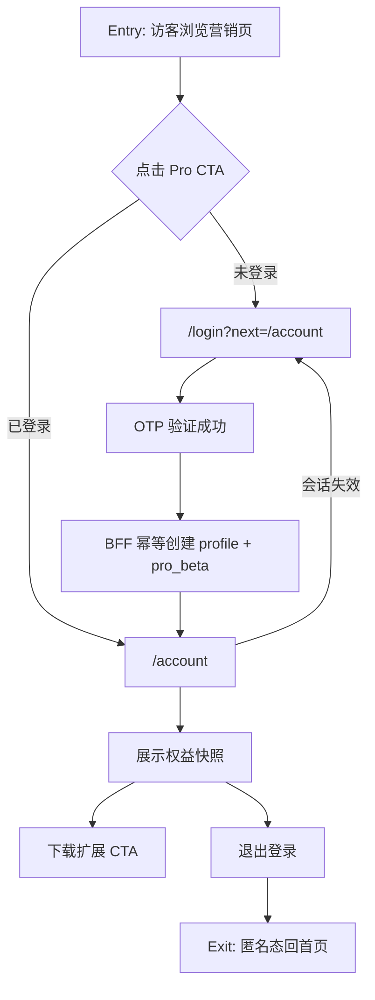
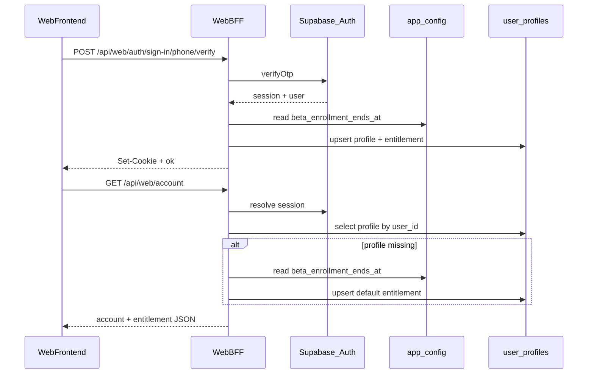
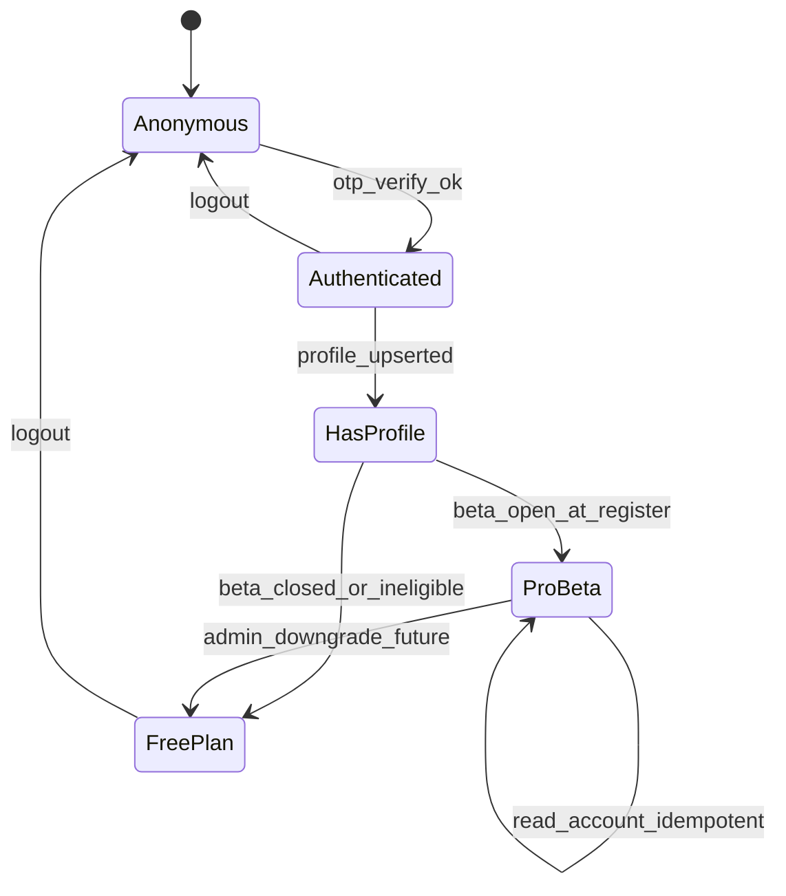

# Feature Spec: 官网账号中心与公测权益

## 1. 史诗目标与商业价值 (Why & Epic Context)

### 史诗归属

**Epic: 官网账号化闭环** — 将已落地的手机号 OTP 登录转化为可感知、可运营、可承诺的用户资产。

### 现状与要解决的问题

| 维度 | 现状 | 缺口 |
|------|------|------|
| 登录 | [`prd-00001-phone-otp-auth`](../prds/prd-00001-phone-otp-auth.md) R0/R1 已部分落地：`/login`、Web BFF、`/api/web/auth/me` | 登录成功后仅顶栏展示脱敏手机号，**无账号目的地页** |
| 营销承诺 | [`marketing-content.ts`](../../app/(marketing)/_config/marketing-content.ts) 专业版文案：「公测期注册终身享受优先升级」「公测期免授权码直接用」 | **注册行为与权益展示未打通** |
| 数据层 | Supabase `auth.users` 存在；[`supabase/migrations/`](../../supabase/migrations/) 尚无业务 profile/权益表 | 无法持久化「用户属于哪一档方案」 |
| 原 PRD 边界 | 登录 PRD R2 明确排除 `user_profiles`、订阅门禁、账号中心 | **本 Feature 承接 R2 中的账号中心 + 公测权益 MVP** |

### 目标（MVP）

1. 登录用户可访问 **`/account` 账号中心**，查看脱敏手机号、注册时间、当前公测权益状态。
2. 公测期内手机号**首次验证登录成功**即获得 **`pro_beta`** 权益（服务端幂等写入，非前端硬编码）。
3. 营销页联动：定价区与 Header 对已登录用户引导「查看我的权益」，未登录用户引导登录并回跳 `/account`。
4. 为后续扩展绑定、付费订阅、企业线索收集预留数据结构，但 MVP 不实现。

### 非目标（明确不做）

- 支付、订单、发票、完整订阅计费系统。
- Chrome 扩展登录 UI、`/api/extension/auth/*`、跨端会话同步。
- 扩展绑定码、设备列表、团队多账号管理。
- 企业版后台、运营人工改权益的管理界面（MVP 仅 DB 字段 + 服务端逻辑）。
- 账号注销自助流程（可列开放项，R1 不做）。
- 国际区号、邮箱登录。

### 术语表

| 术语 | 定义 |
|------|------|
| **账号中心** | 官网 `/account` 页面，需登录访问 |
| **公测权益 `pro_beta`** | 公测期内注册即获得的 Pro 体验档，非付费订阅 |
| **权益快照** | 服务端返回的 `plan` + `status` + 可选 `expiresAt`，页面据此渲染 |
| **profile 幂等创建** | 同一 `auth.users.id` 多次读取 account 不重复插入业务行 |
| **Web BFF** | Next.js `app/api/web/*`，前端不直连 Supabase |
| **公测配置** | `public.app_config` 键 `beta_enrollment_ends_at`；未配置或 `now() <= ends_at` 视为公测开放 |

### 关联文档

- 正式 PRD：[`specs/prds/prd-00002-web-account-center-beta-entitlement.md`](../prds/prd-00002-web-account-center-beta-entitlement.md)
- 父能力 PRD：[`specs/prds/prd-00001-phone-otp-auth.md`](../prds/prd-00001-phone-otp-auth.md)
- 现有会话契约：[`docs/api/web-auth-me.md`](../../docs/api/web-auth-me.md)
- 定价文案：[`app/(marketing)/_config/marketing-content.ts`](../../app/(marketing)/_config/marketing-content.ts)

---

## 2. 核心创意与内生动力学 (Mechanism & Rules)

### 产品机制

登录本身不产生价值感；**「登录 → 立刻看见自己已是公测 Pro」** 才是转化闭环。用户从定价区被「注册享优先升级」吸引，完成 OTP 后进入账号中心看到权益卡片，形成 **蔡加尼克效应的闭合** — 注册动作有明确回报，降低「登了也没用」的流失。

### 已拍板规则（默认假设）

| # | 规则 | 说明 |
|---|------|------|
| R1 | **公测期内新注册即 `pro_beta`** | 首次 verify 创建 profile 时，若 `ends_at` 未配置或 `now() <= ends_at` |
| R2 | **权益以 DB 为准** | 前端不得仅凭 `marketing-content` 推断用户方案；API 返回 `entitlement` |
| R3 | **不承诺永久 Pro** | 页面文案写「公测 Pro 体验中」；`expires_at` 字段预留，MVP 可为 `null` |
| R4 | **profile 服务端创建** | 在 `verify` 成功或 `GET /account` 时 BFF 幂等 upsert，禁止浏览器直写库 |
| R5 | **仅读自己的数据** | RLS：`user_id = auth.uid()`；BFF 使用用户 session，不接受任意 `userId` 参数 |
| R6 | **扩展绑定占位** | 账号页可展示「扩展绑定即将支持」说明，MVP 不实现绑定码 |
| R7 | **公测结束后新用户** | `app_config.beta_enrollment_ends_at` 已过期时新注册 `free`，历史 `pro_beta` 保留 |
| R8 | **授予一次性** | `plan` 在 profile 首次 insert 时确定；已存在 profile 只读 |
| R9 | **公测配置存 DB** | `public.app_config`；运维改日期无需发版；BFF service role 读取 |

### 边界与异常情形（不少于 5 条）

1. **未登录访问 `/account`**：Server Component 检测会话，redirect `/login?next=/account`。
2. **会话过期**：访问 account API 返回 401 或 `{ loggedIn: false }`，前端 redirect 登录页。
3. **并发首次登录**：同一用户多端同时 verify，profile upsert 使用 `ON CONFLICT (user_id) DO NOTHING` 或等价幂等。
4. **越权读取**：客户端传他人 `userId` 无效；BFF 只解析 Cookie 内 session。
5. **公测结束后新注册**：`now() > beta_enrollment_ends_at` 时写入 `plan = free`，账号页展示「免费基础版」。
6. **Supabase 不可用**：account API 返回 503 + 用户可读文案，账号页展示错误态与重试。
7. **已登录访问 `/login`**：沿用现有逻辑 redirect `next`（已有 [`login/page.tsx`](../../app/(marketing)/login/page.tsx)）。

---

## 3. 业务闭环与状态机图 (How)

### 3.1 核心流程图



### 3.2 权益授予时序



### 3.3 用户权益状态机



---

## 4. 数据与 API 衔接

### 4.1 建议数据模型（Migration）

**表 `public.user_profiles`**（单一表 MVP，权益字段内嵌；后续可拆 `user_entitlements`）

| 列 | 类型 | 说明 |
|----|------|------|
| `user_id` | `uuid` PK, FK → `auth.users(id)` | Supabase 用户 ID |
| `phone_e164` | `text` | 冗余存储 `+86...`，便于运营导出（脱敏展示仍走 mask） |
| `plan` | `text` | `free` \| `pro_beta` \| `pro` \| `enterprise`（MVP 用 `free` / `pro_beta`） |
| `entitlement_status` | `text` | `active` \| `expired` \| `revoked` |
| `expires_at` | `timestamptz` null | 公测到期预留 |
| `enrolled_at` | `timestamptz` | 首次授予权益时间 |
| `created_at` | `timestamptz` | 行创建时间 |
| `updated_at` | `timestamptz` | 行更新时间 |

**RLS**：启用；`SELECT/UPDATE` 仅 `auth.uid() = user_id`；**INSERT** 建议仅 service role（BFF 使用 `SUPABASE_SECRET_KEY`）执行，避免客户端伪造 `pro_beta`。

**表 `public.app_config`**（键值型运行时配置）

| 列 | 类型 | 说明 |
|----|------|------|
| `key` | `text` PK | 如 `beta_enrollment_ends_at` |
| `value` | `jsonb` | ISO 8601 时间戳字符串 |
| `updated_at` | `timestamptz` | 最后更新 |

**RLS**：启用且无 policy；BFF 用 service role 读取。migration seed 示例：`beta_enrollment_ends_at` = `"2026-12-31T23:59:59Z"`。运维在 Supabase SQL 更新即可收官，**无需**发版。

### 4.2 Web BFF API（新增）

#### `GET /api/web/account`

读取当前用户账号与权益快照；未登录 `401` 或 `{ "loggedIn": false }`（与 `/me` 语义对齐，工程实现时二选一并文档化）。

**已登录 `200` 示例**

```json
{
  "loggedIn": true,
  "userId": "uuid",
  "phoneMasked": "138****5678",
  "registeredAt": "2026-06-22T02:00:00.000Z",
  "entitlement": {
    "plan": "pro_beta",
    "planLabel": "公测 Pro 体验中",
    "status": "active",
    "expiresAt": null,
    "enrolledAt": "2026-06-22T02:00:00.000Z"
  }
}
```

**行为**：profile 已存在则只读；不存在则幂等创建，读取 `app_config.beta_enrollment_ends_at` 以当前时刻判定 `pro_beta` 或 `free`（**不**查 `auth.users.created_at`）。

#### 与现有 `/api/web/auth/me` 的关系

- **方案 A（推荐）**：保留 `/me` 轻量（仅 Header 用），新增 `/account` 专供账号页。
- **方案 B**：扩展 `/me` 含 `entitlement` — 需评估 Header 是否每次多查 DB；MVP 采用方案 A。

#### `POST /api/web/auth/sign-in/phone/verify` 扩展

验证成功后除写 Cookie 外，**同步幂等 upsert profile**（与 account GET 双保险）。

### 4.3 页面与文件

| 路径 | 说明 |
|------|------|
| `app/(marketing)/account/page.tsx` | 账号中心（新建）；`robots: noindex` |
| `app/(marketing)/account/_components/account-panel.tsx` | 权益卡片、下载扩展、退出入口 |
| `app/(marketing)/_components/layout/auth-status.tsx` | 脱敏号可点击 → `/account` |
| `app/(marketing)/_components/home/pricing-section.tsx` | 已登录 Pro CTA → `/account` |
| `app/(marketing)/_config/marketing-content.ts` | 权益相关文案、`planLabel` 映射 |
| `lib/account/ensure-profile.ts` | 幂等创建与公测授予逻辑 |
| `lib/account/beta-enrollment.ts` | 公测开放判定纯函数 |
| `lib/account/entitlement.ts` | plan → 展示文案 |
| `supabase/migrations/*_user_profiles.sql` | DDL + RLS |
| `supabase/migrations/*_app_config.sql` | `app_config` 表 + seed |
| `docs/api/web-auth-account.md` | 契约文档（新建） |
| `app/sitemap.ts` | **不**收录 `/account`（私有页） |

---

## 5. 端到端剧本 (User Scenarios)

### 剧本 A：名门正派（Happy Path）

访客在首页定价区看到「公测期注册终身享受优先升级」，点击专业版 CTA → `/login?next=/account` → OTP 成功 → 进入账号中心，看到「公测 Pro 体验中」、注册时间、下载扩展按钮。顶栏脱敏号可再次进入账号页。

### 剧本 B：造化弄人

用户填错 OTP：停留 OTP 步，显示 `INVALID_OTP`。用户登录后会话过期再访 `/account`：redirect 登录，成功后回 `/account`。Supabase 短暂 503：账号页展示「暂时无法加载账号信息，请稍后重试」。

### 剧本 C：心怀鬼胎

攻击者伪造 `GET /api/web/account?userId=他人UUID`：BFF 忽略 query，仅返回 Cookie 对应用户。攻击者无 Cookie：401。攻击者尝试用 anon key 直插 `user_profiles`：RLS 拒绝。

### 剧本 D：公测收官

运维在 Supabase 将 `app_config.beta_enrollment_ends_at` 设为已过去日期，新注册用户 verify 后 profile 为 `free`；昨日已 `pro_beta` 用户仍为 `pro_beta`，账号页文案不变。

---

## 6. 决策天条（已拍板 vs 待确认）

| 主题 | 状态 | 决议 |
|------|------|------|
| 公测权益规则 | **已拍板** | 公测开启时注册即 `pro_beta` |
| 到期日展示 | **已拍板** | 保留字段，页面不写「永久 Pro」 |
| 扩展绑定 | **已拍板** | MVP 仅文案占位 |
| profile 创建时机 | **已拍板** | verify + GET account 双路径幂等 |
| API 拆分 | **已拍板** | 新增 `GET /api/web/account`，不扩 `/me` |
| 老用户追溯授予 | **不做** | 线上无老用户；仅在首次 profile insert（verify）时授予 |
| 账号注销 | **待确认** | MVP 不做；隐私政策是否补充「注销申请方式」 |
| 法务审阅 | **待确认** | 「公测 Pro 体验中」与定价「终身享受优先升级」措辞需产品/法务对齐 |

---

## 7. 敏捷故事地图与开发 Backlog (What & Issue Backlog)

### 用户旅程（8 步）

1. 浏览定价 → 2. 点击 CTA → 3. 登录/注册 OTP → 4. 进入账号中心 → 5. 查看权益 → 6. 下载扩展 → 7. 回访账号页 → 8. 退出登录

### 开发 Backlog（可直接导入 Issue）

- [ ] **FEAT-00001-01-DB**: [数据库] `user_profiles` + `app_config` 表与 RLS migration
  - **As a** 平台工程 **I want to** 在 Supabase 中持久化用户方案、权益与公测配置 **So that** 账号中心与运营收官可复用同一事实源。
  - **AC (验收标准)**:
    - **Given** 空数据库且 migration 已应用
    - **When** 执行 `supabase db push` 或等效迁移
    - **Then** 存在 `public.user_profiles`、`public.app_config`（含 `beta_enrollment_ends_at` seed）、RLS 启用且 anon 无法任意读写他人行

- [ ] **FEAT-00001-02-BFF**: [BFF] 幂等 profile 创建与公测授予逻辑
  - **As a** 官网后端 **I want to** 在 verify 首次创建 profile 时按 `app_config` 日期授予权益 **So that** 新用户登录后有可展示的权益快照。
  - **AC**:
    - **Given** `beta_enrollment_ends_at` 未配置或为未来日期，且用户首次 OTP 验证成功
    - **When** BFF 处理 verify
    - **Then** `user_profiles.plan = pro_beta` 且 `entitlement_status = active`，重复调用不产生重复行
    - **Given** `beta_enrollment_ends_at` 为已过去日期
    - **When** 新用户首次 verify
    - **Then** `plan = free`

- [ ] **FEAT-00001-03-API**: [BFF] `GET /api/web/account` 端点
  - **As a** 官网前端 **I want to** 通过 BFF 获取账号与权益 JSON **So that** 不暴露 Supabase 密钥且字段稳定。
  - **AC**:
    - **Given** 用户持有有效官网 Cookie
    - **When** `GET /api/web/account`
    - **Then** 返回 `phoneMasked`、`registeredAt`、`entitlement.planLabel` 等契约字段；无 Cookie 时 401 或 `{ loggedIn: false }`

- [ ] **FEAT-00001-04-FE**: [前端] `/account` 账号中心页面
  - **As a** 已登录用户 **I want to** 在专属页面查看我的账号与公测权益 **So that** 我确认注册带来了实际价值。
  - **AC**:
    - **Given** 用户已登录且权益为 `pro_beta`
    - **When** 访问 `/account`
    - **Then** 展示脱敏手机号、注册时间、权益卡片「公测 Pro 体验中」、下载扩展与退出入口
    - **Given** 用户未登录
    - **When** 访问 `/account`
    - **Then** redirect `/login?next=/account`

- [ ] **FEAT-00001-05-FE**: [前端] Header 与定价区 CTA 联动
  - **As a** 访客或已登录用户 **I want to** 从顶栏和定价区进入账号中心 **So that** 转化路径连贯。
  - **AC**:
    - **Given** 用户已登录且在首页定价区
    - **When** 点击专业版 CTA
    - **Then** 导航至 `/account` 而非仅外链商店
    - **Given** 用户未登录点击 Pro CTA
    - **When** 触发登录引导
    - **Then** 跳转 `/login?next=/account`

- [ ] **FEAT-00001-06-FE**: [前端] `auth-status` 脱敏号链至账号页
  - **As a** 已登录用户 **I want to** 点击顶栏手机号进入账号中心 **So that** 我不必记忆 `/account` URL。
  - **AC**:
    - **Given** 顶栏展示 `138****5678`
    - **When** 点击该手机号或旁侧「我的账号」
    - **Then** 进入 `/account`

- [ ] **FEAT-00001-07-CONTENT**: [内容] 权益文案与定价承诺对齐
  - **As a** 产品运营 **I want to** 统一 `marketing-content` 与账号页权益表述 **So that** 用户不被矛盾文案误导。
  - **AC**:
    - **Given** 专业版 `promo` 含「注册」相关承诺
    - **When** 用户完成注册并在账号页查看
    - **Then** 账号页 `planLabel` 与定价区承诺语义一致（公测体验，非永久付费 Pro）

- [ ] **FEAT-00001-08-DOC**: [文档] API 契约 `web-auth-account.md` 与 OpenAPI 片段
  - **As a** 前端/测试 **I want to** 有 account API 的 Markdown 与 OpenAPI 定义 **So that** 联调与契约测试可复用。
  - **AC**:
    - **Given** `GET /api/web/account` 已实现
    - **When** 查阅 `docs/api/web-auth-account.md`
    - **Then** 含请求/响应示例、错误码与未登录语义

- [ ] **FEAT-00001-09-TEST**: [测试] profile 幂等与 entitlement 单测
  - **As a** 工程 **I want to** Vitest 覆盖授予与幂等逻辑 **So that** 回归安全。
  - **AC**:
    - **Given** mock Supabase 或纯函数层
    - **When** 连续两次 `ensureProfile`
    - **Then** 仅一条 profile；`ends_at` 未来 → `pro_beta`、过去 → `free`、未配置 → `pro_beta`

- [ ] **FEAT-00001-10-SEO**: [合规] 隐私政策账号数据条款复核
  - **As a** 合规 **I want to** 隐私政策说明账号页收集/展示的字段 **So that** 与 [`privacy/_content.ts`](../../app/(marketing)/privacy/_content.ts) 已有「账号化能力」表述一致。
  - **AC**:
    - **Given** 账号页展示 plan 与注册时间
    - **When** 查阅隐私政策相关章节
    - **Then** 含「方案档位、公测权益状态」等说明或标注作法务审阅待补

### Release 切片

| Release | 交付物 | 可验收结果 |
|---------|--------|------------|
| **R0 MVP** | migration（`user_profiles` + `app_config`）、`ensure-profile`、`GET /account`、`/account` 页、Header/定价联动 | 新用户登录后可见 `pro_beta`；未登录不可访问 account |
| **R1** | 契约文档、单测、503 错误态 UI、隐私复核 | `pnpm test` 通过；文档与实现对齐 |
| **R2（范围外）** | 扩展绑定、付费订阅、运营后台改权益 | 另开 Feature / PRD |

---

## 8. 假设与待确认 / 开放项

### 假设

- 继续共用 [`prd-00001-phone-otp-auth`](../prds/prd-00001-phone-otp-auth.md) 的 Supabase 项目与 BFF Cookie 会话。
- BFF 使用 `SUPABASE_SECRET_KEY` 写 profile、读 `app_config`；前端仍无 `NEXT_PUBLIC_SUPABASE_*`。
- 公测结束日存于 `app_config`；运维在 Supabase 更新日期即可，无需 Vercel 发版。

### 开放项

| # | 项 | 建议 |
|---|-----|------|
| 1 | 「终身享受优先升级」与「公测体验」文案 | 产品+法务统一口径后更新 `marketing-content` |
| 2 | `/account` 是否展示「扩展绑定即将支持」插图 | UI 稿确认 |
| 3 | 登录成功默认跳转 | 维持 `next` 参数；定价 CTA 显式带 `next=/account` |
| 4 | `app_config` 读取缓存 | 可选 R1：短 TTL 内存缓存，非 R0 必须 |
| 5 | 后续正式 PRD | 已产出 [`prd-00002-web-account-center-beta-entitlement`](../prds/prd-00002-web-account-center-beta-entitlement.md) |

### 冲突与决议需求

- [`AGENTS.md`](../../AGENTS.md) 仍描述「静态营销站」；本 Feature 引入业务表与 BFF 读写在 AGENTS 后续 PR 中同步更新描述。
- 登录 PRD R2 范围与本 Feature 重叠部分以 **本 Feature Spec 为账号中心事实源**，登录 PRD 不再扩展 R2。

---

## 9. 修订记录

| 日期 | 说明 |
|------|------|
| 2026-06-22 | 初稿：官网账号中心 + 公测 `pro_beta` 权益；承接登录 PRD R2；含 Backlog FEAT-00001-01～10 |
| 2026-06-22 | 升格为正式 PRD [`prd-00002-web-account-center-beta-entitlement`](../prds/prd-00002-web-account-center-beta-entitlement.md) |
| 2026-06-22 | 同步 PRD 修订：公测改 `app_config.beta_enrollment_ends_at`；移除老用户补授 |
