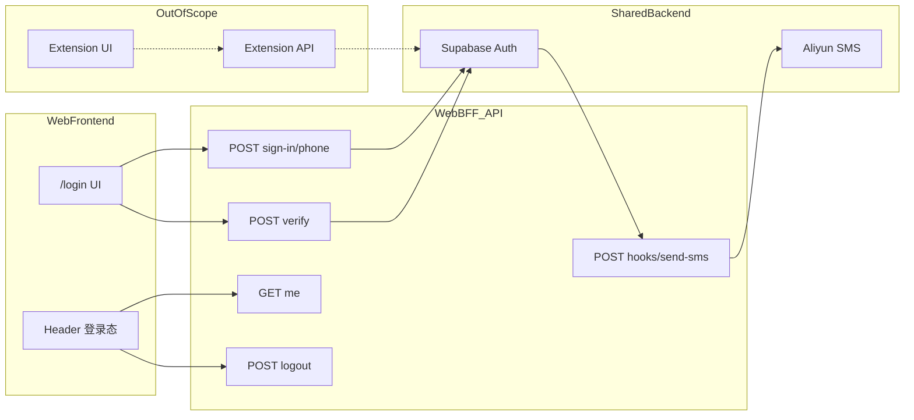
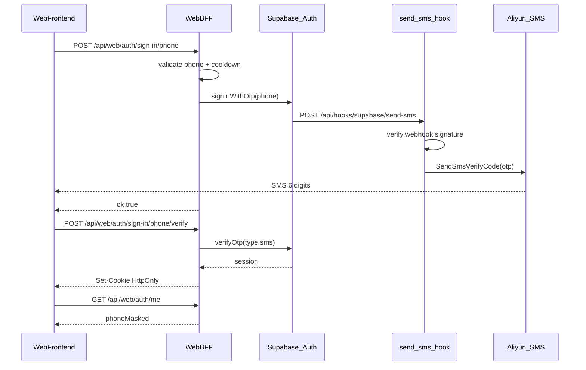
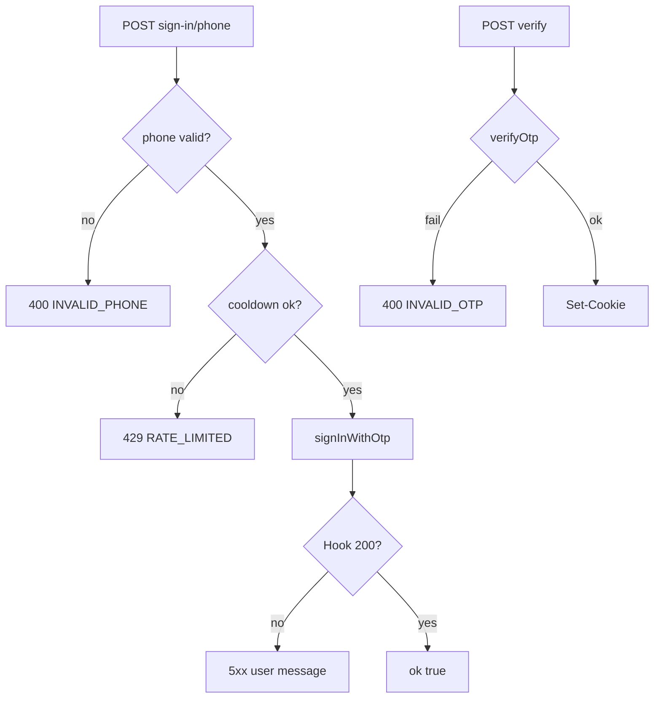
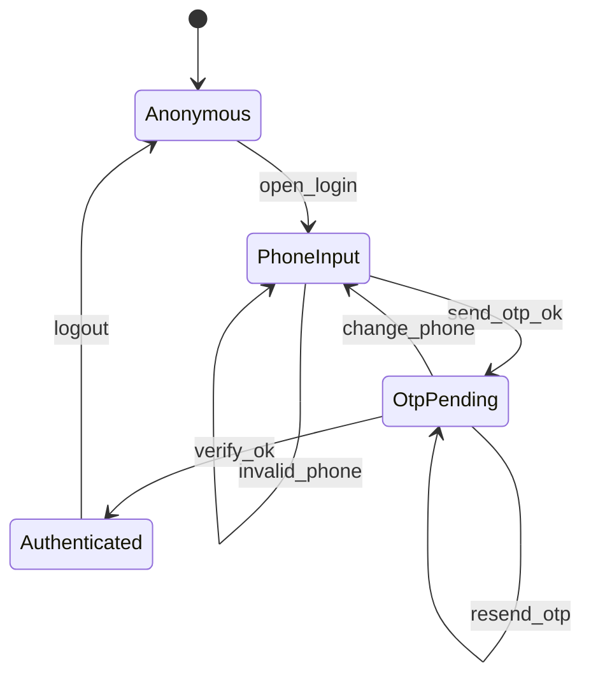

# PRD：官网手机号 OTP 注册/登录（前后端分离）

| 属性 | 说明 |
|------|------|
| **状态** | `backlog` |
| **范围** | 智赢媒体助手**官网** Web 客户端 + Web BFF API：手机号 OTP 注册/登录、HttpOnly 会话、Send SMS Hook（阿里云）；**不含** Chrome 扩展登录 |
| **关联文档** | [`AGENTS.md`](../../AGENTS.md)、[`.env.example`](../../.env.example)、[`lib/site-config.ts`](../../lib/site-config.ts) |
| **参考实现** | 互远技能中心 `huyuan-ai-skills-gate`：`app/api/hooks/supabase/send-sms`、`lib/aliyun-sms.ts`、`app/api/site/auth/sign-in/phone/*`（本仓库映射为 `/api/web/auth/*`） |

---

## 1. 背景与问题

### 1.1 现状

- 官网（`quammediaweb`）当前为**静态营销站**：[`AGENTS.md`](../../AGENTS.md) 约定暂不接入 Supabase 客户端 SDK；[`site-header.tsx`](../../app/(marketing)/_components/layout/site-header.tsx) 无登录入口。
- 已初始化 Supabase CLI（[`supabase/config.toml`](../../supabase/config.toml)、[`supabase/migrations/`](../../supabase/migrations/)），环境变量模板见 [`.env.example`](../../.env.example)。
- Chrome 扩展（源码不在本仓库）未来需要账号能力，但**不应与官网登录逻辑耦在同一 PRD / 同一 API 面**。

### 1.2 要解决的问题

1. 用户在官网用**中国大陆手机号 + 6 位短信验证码**完成注册与登录（Supabase `signInWithOtp`，首次验证即注册）。
2. **前后端分离**：Web 前端只调 Web BFF JSON API；密钥、Supabase 调用、阿里云发短信均在服务端。
3. 短信经 **Supabase Send SMS HTTP Hook** → 本站 `/api/hooks/supabase/send-sms` → **阿里云 Dypnsapi**（参考互远技能中心已验证实现）；OTP 由 Supabase 生成与校验，阿里云仅透传 `sms.otp`。
4. 为后续账号化能力（订阅、用户中心等）建立官网侧身份底座；扩展登录**另独立 PRD**。

---

## 2. 目标与非目标

### 2.1 目标

| # | 目标 |
|---|------|
| G1 | Web 前端 `/login` 分步 UI：手机号步 → 6 格 OTP 步（`InputOTP`） |
| G2 | Web BFF：`POST /api/web/auth/sign-in/phone`、`/verify`、`GET /me`、`POST /logout` |
| G3 | Send SMS Hook + 阿里云发信；6 位 OTP；30s 发码节流 |
| G4 | 登录前勾选 [`/terms`](../../app/(marketing)/terms/page.tsx)、[`/privacy`](../../app/(marketing)/privacy/page.tsx) |
| G5 | Header「登录」→ `/login`；登录后顶栏展示**脱敏手机号**与「退出」 |
| G6 | HttpOnly Cookie 会话；前端**不**暴露 `NEXT_PUBLIC_SUPABASE_*` |

### 2.2 非目标

- Chrome 扩展登录 UI、Extension API（`/api/extension/auth/*`）、Extension Bridge、官网与扩展会话同步。
- 邮箱/密码登录；国际区号（R0 固定 +86）。
- 账号中心业务页、订阅/付费门禁（后续 PRD）。
- 在本文档内定义扩展 `host_permissions`、CORS、`externally_connectable`。
- R1 **不考虑**任何插件相关问题。

### 2.3 成功标准（可度量）

| 指标 | 说明 |
|------|------|
| 登录闭环 | 真实 +86 手机号：发码 → 收 6 位短信 → 验证 → `GET /me` 200，≤ 2 分钟（人工抽检 10 次） |
| 前后端边界 | 生产构建产物中 Web 前端 bundle **无** Supabase secret / 阿里云 AK |
| 节流 | 同号 30s 内重复发码返回 429 且前端倒计时 |
| 合规 | 未勾选协议时「发送验证码」disabled |

---

## 3. 术语

| 术语 | 定义 |
|------|------|
| **Web 前端** | 官网 React 页面与组件（`/login`、`SiteHeader` 等），仅消费 Web BFF |
| **Web BFF** | Next.js `app/api/web/auth/*` 路由层，代理 Supabase Auth 并管理 Cookie |
| **Send SMS Hook** | Supabase Auth 在发 OTP 时调用的 HTTP Webhook，本站实现于 `/api/hooks/supabase/send-sms` |
| **OTP** | 6 位数字短信验证码，由 Supabase 生成，`verifyOtp({ type: 'sms' })` 校验 |
| **E.164** | 带国家码手机号，本站统一为 `+86` + 11 位大陆号码 |
| **官网会话** | 验证成功后 BFF 写入的 HttpOnly Cookie（含 refresh token 等），仅浏览器官网域可用 |
| **Extension API** | 将来扩展专用 BFF 前缀（如 `/api/extension/auth/*`），**不在本 PRD 范围** |

---

## 4. 已拍板规则 / 取舍

| 主题 | 已定 | 说明 |
|------|------|------|
| 架构 | **前后端分离** | 前端只调 `/api/web/auth/*`；不直连 Supabase |
| API 前缀 | `/api/web/auth/*` | 与将来 `/api/extension/auth/*` 路由层物理分离 |
| 区号 | R0 固定 **+86** | UI 展示 +86，输入 11 位大陆手机号 |
| OTP 长度 | **6 位** | UI 六格 `InputOTP`；与 Supabase `otp_length` 对齐 |
| 注册/登录 | **合一** | `signInWithOtp` + `verifyOtp`，首次即建 `auth.users` |
| 协议勾选 | **必须** | 未勾选禁用发码按钮 |
| 发码节流 | **30s** | BFF 层 + 前端倒计时（参考技能中心 `COOLDOWN_SECONDS`） |
| 顶栏展示 | **脱敏手机号** | 如 `138****5678` |
| 前端 SDK | **不用** | R0 全 BFF 代理，不暴露 `NEXT_PUBLIC_SUPABASE_*` |
| 防刷 | R0 无 Captcha | 依赖 Supabase rate limit + 30s 节流 |
| 会话 | HttpOnly Cookie | 存 refresh；access 刷新策略 R1 细化 |
| Chrome 扩展 | **本 PRD 无关** | 共用 Supabase 项目可选，但 API 与会话存储分离；扩展另 PRD |
| 阿里云模板 | 透传 Supabase OTP | **禁止**模板使用 `##code##`（会与库内码不一致） |
| 入口 | Header → `/login` | 分步卡片内流转，非整页多路由跳转 |

---

## 5. 用户与角色

| 角色 | 目标 |
|------|------|
| **运营/博主用户（主）** | 在官网用手机号快速登录 |
| **未登录访客** | 浏览营销页，需要时进入 `/login` |
| **官网前端工程** | 实现纯 UI + 调 Web BFF |
| **官网后端工程** | Web BFF、Hook、会话、错误码 |
| **扩展工程（范围外）** | 后续独立 PRD 定义 Extension API |

---

## 6. 功能域（实现指引）

### 6.1 架构：三层分离



### 6.2 Web BFF API

| 方法 | 路径 | 请求体 | 响应 / 副作用 |
|------|------|--------|----------------|
| POST | `/api/web/auth/sign-in/phone` | `{ "phone": "13812345678" }` | `{ "ok": true }`；触发 Supabase 发码；429 含 `retryAfter` |
| POST | `/api/web/auth/sign-in/phone/verify` | `{ "phone": "...", "token": "123456" }` | `{ "ok": true }`；`Set-Cookie` 官网会话 |
| GET | `/api/web/auth/me` | —（Cookie） | `{ "loggedIn": true, "phoneMasked": "138****5678", "userId": "..." }` |
| POST | `/api/web/auth/logout` | — | 清 Cookie；`{ "ok": true }` |
| POST | `/api/hooks/supabase/send-sms` | Supabase Hook 载荷 | 验签后发阿里云；200 + `{}` |

**错误体约定**：`{ "ok": false, "code": "INVALID_PHONE" | "RATE_LIMITED" | "INVALID_OTP" | ..., "error": "用户可读文案", "retryAfter?": number }`

**手机号规范化**：BFF 内 `parseChinaMobileToE164`（11 位 `1` 开头 → `+86...`）；非法号返回 `INVALID_PHONE`。

### 6.3 Send SMS Hook（服务端）

- 路径：[`app/api/hooks/supabase/send-sms/route.ts`](../../app/api/hooks/supabase/send-sms/route.ts)（新建，参考 `huyuan-ai-skills-gate` 同名文件）。
- 库：[`lib/supabase-send-sms-hook.ts`](../../lib/supabase-send-sms-hook.ts)（Standard Webhooks 验签）、[`lib/aliyun-sms.ts`](../../lib/aliyun-sms.ts)（`SendSmsVerifyCode`，`templateParam: {"code":"<otp>","min":"5"}`）。
- 环境变量（补充 [`.env.example`](../../.env.example)）：

| 变量 | 说明 |
|------|------|
| `SEND_SMS_HOOK_SECRET` | Dashboard Hooks 完整 secret（`v1,whsec_...`） |
| `ALIYUN_ACCESS_KEY_ID` / `ALIYUN_ACCESS_KEY_SECRET` | RAM AK/SK |
| `ALIYUN_SMS_SIGN_NAME` | 可选，默认 `速通互联验证码` |
| `ALIYUN_SMS_TEMPLATE_CODE` | 可选，默认 `100001` |
| `ALIYUN_SMS_VALID_MINUTES` | 可选，默认 `5` |

依赖（用户本地安装）：

```bash
pnpm add standardwebhooks @alicloud/dypnsapi20170525 @alicloud/openapi-client @alicloud/tea-util @alicloud/credentials
pnpm add @supabase/supabase-js
```

### 6.4 Web 前端：`/login`

- 路由：[`app/(marketing)/login/page.tsx`](../../app/(marketing)/login/page.tsx)（新建）。
- 组件：[`app/(marketing)/login/_components/login-panel.tsx`](../../app/(marketing)/login/_components/login-panel.tsx)（新建，`"use client"`）。

**Step 1 — 手机号**

| 元素 | 行为 |
|------|------|
| 区号 | 左侧固定 `+86`（不可改） |
| 输入 | 11 位数字，`inputMode="numeric"` |
| 协议 | Checkbox + 链至 `/terms`、`/privacy`（`target="_blank"`） |
| 主按钮 | 「发送验证码」— 号合法且已勾选协议方可点 |

**Step 2 — OTP**

| 元素 | 行为 |
|------|------|
| 提示 | 「验证码已发送至 +86 138****5678」+「修改号码」 |
| 输入 | shadcn **`InputOTP` 六格**，仅数字 |
| 主按钮 | 「登录」— 满 6 位方可点 |
| 次按钮 | 「重新发送」（30s 倒计时）、返回改号 |

**登录成功**：`router.push(sanitizeNext(next) ?? '/')` + `router.refresh()`；已登录用户访问 `/login` → `redirect` 至 `next` 或 `/`。

**Header 改造**：[`site-header.tsx`](../../app/(marketing)/_components/layout/site-header.tsx) 增加「登录」链至 `/login`；已登录显示脱敏手机号 + 退出（调 `POST /api/web/auth/logout`）。

### 6.5 Supabase Dashboard / 本地配置

1. **Authentication → Providers → Phone**：启用。
2. **Authentication → Hooks → Send SMS**：Type HTTP；URL `https://<siteOrigin>/api/hooks/supabase/send-sms`；Secret → `SEND_SMS_HOOK_SECRET`。
3. **勿**配置 Twilio 等内置 SMS。
4. 本地 [`supabase/config.toml`](../../supabase/config.toml) 调整：
   - `[auth.sms] enable_signup = true`（当前为 `false`）
   - 确认 SMS OTP 长度为 6（与 `[auth.mfa.phone] otp_length = 6` 对齐）
   - 可选 `[auth.hook.send_sms]` 指向本地 Next dev（或 ngrok）

Hook 约束：5s 总超时（含最多 3 次重试）；成功须 HTTP 200 + `{}`。

---

## 7. 用户故事地图与版本切片

### 7.1 旅程主干（含起止）

| 阶段 | 用户目标 | Entry | Exit / Teardown |
|------|----------|-------|-----------------|
| 浏览 | 了解产品 | 打开任意营销页 | 点击「登录」或离开 |
| 登录 | 建立官网身份 | `/login` 或 Header | Cookie 写入；跳转 `next` 或 `/` |
| 使用 | 浏览已登录态 | Header 显示脱敏号 | 点击「退出」 |
| 登出 | 结束会话 | 点击退出 | `POST /logout` 清 Cookie → 未登录态 |

### 7.2 用户故事地图

#### 阶段 A：发现与进入登录

| 故事 | 验收要点 |
|------|----------|
| 作为访客，我想从顶栏进入登录页 | Header 有「登录」→ `/login` |
| 作为访客，我想在登录页看到清晰两步流程 | Step1 手机号 → Step2 OTP，同卡片内切换 |
| 作为访客，我想登录后回到原页面 | `?next=` 仅允许站内相对路径，防开放重定向 |

#### 阶段 B：手机号与发码

| 故事 | 验收要点 |
|------|----------|
| 作为用户，我想输入 +86 大陆手机号 | 非 11 位或非法号时按钮 disabled |
| 作为用户，我想在发码前同意协议 | 未勾选时「发送验证码」disabled |
| 作为用户，我想收到 6 位短信验证码 | 短信内容与 Supabase OTP 一致；30s 内不能重复发 |

#### 阶段 C：验证与会话

| 故事 | 验收要点 |
|------|----------|
| 作为用户，我想用 6 格输入验证码 | `InputOTP` 满 6 位可点「登录」 |
| 作为用户，验证码错误时我想看到明确提示 | 不泄露 Supabase 内部错误码 |
| 作为用户，登录成功后顶栏显示我已登录 | `GET /me` 返回 `phoneMasked` |
| 作为用户，我想退出登录 | `POST /logout` 后顶栏回「登录」 |

#### 阶段 D：新用户注册

| 故事 | 验收要点 |
|------|----------|
| 作为新用户，首次 OTP 成功即完成注册 | Supabase `auth.users` 新建记录，无需单独注册页 |

### 7.3 Release 切片

| Release | 交付物 | 可验收结果 |
|---------|--------|------------|
| **R0 MVP** | Web BFF 四接口；Hook + 阿里云；`/login` 分步 UI；Header 登录/退出；协议勾选；30s 节流；`.env.example` 补齐 | 官网真实手机 OTP 登录闭环；顶栏状态正确 |
| **R1** | `/me` 契约文档化；可选会话 refresh；隐私政策增补短信/账号条款；Hook 验签与 E.164 单测；顶栏加载态 | 登录态可靠、可测、合规文案就绪 |
| **R2（后续 PRD）** | `user_profiles` 表、订阅门禁、账号中心 | 不在本 PRD 实现 |

**R1 明确排除**：扩展 API、Bridge、跨端会话、扩展 OTP UI。

---

## 8. 核心流程与状态机图

### 8.1 主业务时序（Happy Path + 发码）



### 8.2 异常分支（摘选）



### 8.3 登录状态机



---

## 9. 数据与 API 衔接

### 9.1 页面与内容文件

| 路径 | 说明 |
|------|------|
| `app/(marketing)/login/page.tsx` | 登录页（新建） |
| `app/(marketing)/login/_components/login-panel.tsx` | 分步登录 UI（新建） |
| `app/(marketing)/_components/layout/site-header.tsx` | 登录入口与登录态 |
| `app/(marketing)/terms/page.tsx` | 服务协议（已有，登录勾选链接） |
| `app/(marketing)/privacy/page.tsx` | 隐私政策（已有；R1 增补短信条款） |
| `lib/site-config.ts` | `ORG_CONFIG.siteOrigin` 影响 Hook URL、canonical |

### 9.2 数据存储

| 存储 | R0 | 说明 |
|------|-----|------|
| `auth.users`（Supabase） | 是 | 手机号、验证状态；无业务 `profiles` 表 |
| 官网 HttpOnly Cookie | 是 | refresh / 会话标识；域为 `siteOrigin` |
| `supabase/migrations/` | 按需 | R0 可能仅 `config.toml` + Dashboard；业务表属 R2 |

### 9.3 与 Chrome 扩展的边界

- 扩展与官网可共用**同一 Supabase 项目**（同号同 `user.id`），但：
  - 官网：**`/api/web/auth/*` + Cookie**
  - 扩展：**`/api/extension/auth/*`（另 PRD）+ `chrome.storage`**
- 本 PRD **不**定义扩展 API、不实现跨端会话同步。

---

## 10. 假设与待确认 / 开放项

### 10.1 假设

- 生产站点域名为 [`ORG_CONFIG.siteOrigin`](../../lib/site-config.ts)（`https://smzs.t.xds365.com`），与 Vercel 部署一致。
- 阿里云号码认证服务已开通，RAM 具备 `dypns:SendSmsVerifyCode`。
- R0 仅服务中国大陆 +86 用户。

### 10.2 开放项（工程 / 运营补齐）

| # | 项 | 默认 / 建议 |
|---|-----|-------------|
| 1 | 隐私政策增补「官网账号、手机号、短信」 | R1 法务审阅 [`privacy/_content.ts`](../../app/(marketing)/privacy/_content.ts) |
| 2 | 阿里云专用签名/模板（品牌「智赢媒体助手」） | R0 可先用默认 `速通互联验证码` / `100001` |
| 3 | 本地无公网 Hook | 使用 `auth.sms.test_otp` 或 ngrok |
| 4 | Cookie 名、路径、`SameSite`、`Secure` 具体值 | 工程在 BFF 实现时写入 ADR 或代码注释 |
| 5 | 扩展登录 PRD | 建议 slug `extension-phone-otp-auth`，独立落盘 |

---

## 11. 修订记录

| 日期 | 说明 |
|------|------|
| 2026-06-19 | 初稿：官网前后端分离手机号 OTP；Web BFF `/api/web/auth/*`；扩展不在范围；R1 不含插件 |
