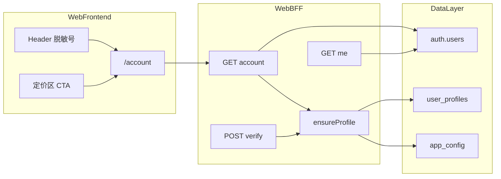
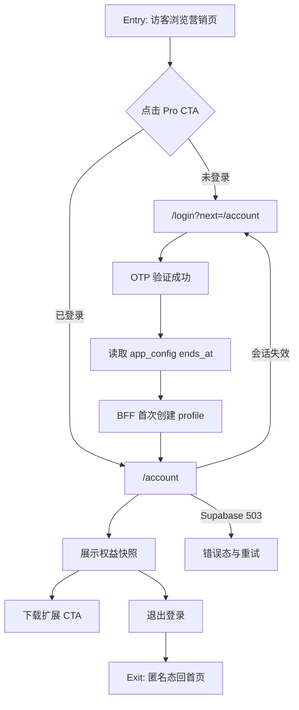
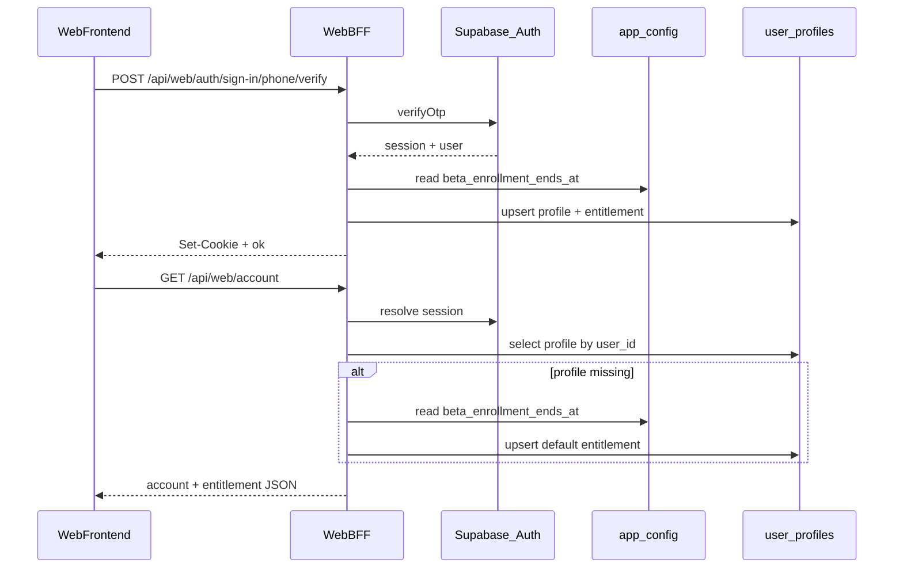
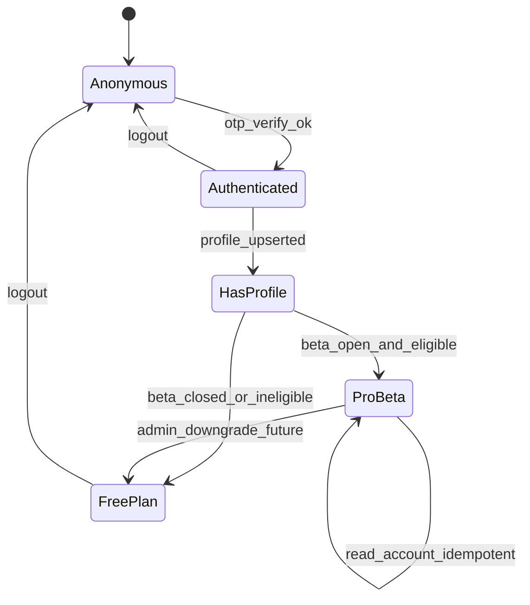
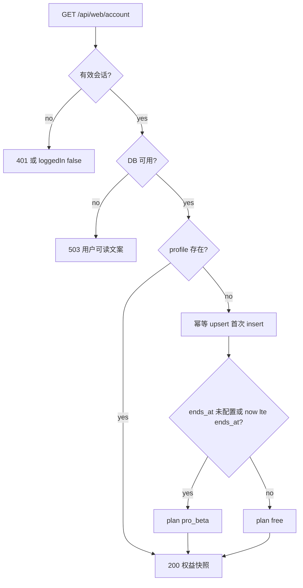

# PRD：官网账号中心与公测权益

| 属性 | 说明 |
|------|------|
| **状态** | 产品：`backlog` |
| **范围** | 官网 `/account` 账号中心、公测 `pro_beta` 权益授予与展示、Web BFF `GET /api/web/account`、`user_profiles` + `app_config` 业务表；**承接** [`prd-00001-phone-otp-auth.md`](prd-00001-phone-otp-auth.md) R2 |
| **关联文档** | [`specs/features/feat-00001-web-account-center-beta-entitlement.md`](../features/feat-00001-web-account-center-beta-entitlement.md)、[`prd-00001-phone-otp-auth.md`](prd-00001-phone-otp-auth.md)、[`docs/api/web-auth-me.md`](../../docs/api/web-auth-me.md)、[`app/(marketing)/_config/marketing-content.ts`](../../app/(marketing)/_config/marketing-content.ts) |
| **父能力** | 手机号 OTP 登录（Web BFF + Supabase Auth + Cookie 会话） |

---

## 1. 背景与问题

### 1.1 现状

| 维度 | 现状 | 缺口 |
|------|------|------|
| 登录 | [`prd-00001-phone-otp-auth`](prd-00001-phone-otp-auth.md) R0/R1 已部分落地：`/login`、Web BFF、`GET /api/web/auth/me` | 登录成功后仅顶栏展示脱敏手机号，**无账号目的地页** |
| 营销承诺 | [`marketing-content.ts`](../../app/(marketing)/_config/marketing-content.ts) 专业版文案：「公测期注册终身享受优先升级」「公测期免授权码直接用」 | **注册行为与权益展示未打通** |
| 数据层 | Supabase `auth.users` 存在；[`supabase/migrations/`](../../supabase/migrations/) 尚无业务 profile/权益表 | 无法持久化「用户属于哪一档方案」 |
| 父 PRD 边界 | 登录 PRD R2 明确排除 `user_profiles`、订阅门禁、账号中心 | **本 PRD 承接 R2 中的账号中心 + 公测权益 MVP** |

### 1.2 要解决的问题

1. 登录用户可访问 **`/account` 账号中心**，查看脱敏手机号、注册时间、当前公测权益状态。
2. 公测期内手机号**首次验证登录成功**即获得 **`pro_beta`** 权益（服务端幂等写入，非前端硬编码）。
3. 营销页联动：定价区与 Header 对已登录用户引导「查看我的权益」，未登录用户引导登录并回跳 `/account`。
4. 为后续扩展绑定、付费订阅、企业线索收集预留数据结构，但 MVP 不实现。

### 1.3 价值假设

登录本身不产生价值感；**「登录 → 立刻看见自己已是公测 Pro」** 才是转化闭环。用户从定价区被「注册享优先升级」吸引，完成 OTP 后进入账号中心看到权益卡片，形成注册动作有明确回报，降低「登了也没用」的流失。

### 1.4 与父 PRD 的关系

- [`prd-00001-phone-otp-auth`](prd-00001-phone-otp-auth.md) §7.3 R2 所列 `user_profiles`、账号中心 **由本 PRD 实现**；登录 PRD **不再扩展 R2**。
- 共用 Supabase 项目、HttpOnly Cookie 会话、Send SMS Hook；**不引入**新认证方式。

---

## 2. 目标与非目标

### 2.1 目标

| # | 目标 |
|---|------|
| G1 | 已登录用户访问 `/account`，查看脱敏手机号、注册时间、权益快照 |
| G2 | 公测开启时，新用户 OTP 验证成功即服务端授予 `pro_beta`（幂等） |
| G3 | 新增 `GET /api/web/account`；`verify` 成功后同步幂等 upsert profile |
| G4 | `public.user_profiles` 表 + RLS；BFF 使用 `SUPABASE_SECRET_KEY` 写入 |
| G5 | Header 脱敏号链至 `/account`；定价区专业版 CTA 引导登录或进入账号中心 |
| G6 | 公测开放由 `app_config.beta_enrollment_ends_at` 判定；结束后**新注册**为 `free`，已授予 `pro_beta` 保留 |
| G7 | `public.app_config` 表存公测结束日；运维在 Supabase 改日期即可收官，**无需**发版 |

### 2.2 非目标

- 支付、订单、发票、完整订阅计费系统。
- Chrome 扩展登录 UI、`/api/extension/auth/*`、跨端会话同步。
- 扩展绑定码、设备列表、团队多账号管理（MVP 仅文案占位）。
- 企业版后台、运营人工改权益的管理界面（MVP 仅 DB 字段 + 服务端逻辑）。
- 账号注销自助流程（可列开放项，R1 不做）。
- 国际区号、邮箱登录。

### 2.3 成功标准（可度量）

| 指标 | 说明 |
|------|------|
| 权益闭环 | 公测开启 + 新用户：OTP 成功 → 访问 `/account` 可见 `pro_beta`，≤ 2 分钟（人工抽检 5 次） |
| 门禁 | 未登录访问 `/account` 100% redirect `/login?next=/account` |
| 幂等 | 同一用户连续 verify + GET account 不产生重复 profile 行 |
| 前后端边界 | 前端不硬编码 plan；权益以 API `entitlement` 为准 |
| 质量（R1） | `pnpm test` 覆盖 `ensureProfile` 幂等与 `beta_enrollment_ends_at` 判定；契约文档与实现对齐 |

---

## 3. 术语

| 术语 | 定义 |
|------|------|
| **账号中心** | 官网 `/account` 页面，需登录访问 |
| **公测权益 `pro_beta`** | 公测期内注册即获得的 Pro 体验档，非付费订阅 |
| **权益快照** | 服务端返回的 `plan` + `status` + 可选 `expiresAt`，页面据此渲染 |
| **profile 幂等创建** | 同一 `auth.users.id` 多次读取 account 不重复插入业务行 |
| **Web BFF** | Next.js `app/api/web/*`，前端不直连 Supabase |
| **公测配置** | `public.app_config` 键 `beta_enrollment_ends_at`（ISO 时间戳 JSON）；未配置或 `now() <= ends_at` 视为公测开放 |

---

## 4. 已拍板规则 / 取舍

| # | 主题 | 已定 | 说明 |
|---|------|------|------|
| R1 | 公测期内新注册即 `pro_beta` | **是** | 首次 verify 创建 profile 时，若 `ends_at` 未配置或 `now() <= ends_at` |
| R2 | 权益以 DB 为准 | **是** | 前端不得仅凭 `marketing-content` 推断用户方案；API 返回 `entitlement` |
| R3 | 不承诺永久 Pro | **是** | 页面文案写「公测 Pro 体验中」；`expires_at` 字段预留，MVP 可为 `null` |
| R4 | profile 服务端创建 | **是** | 在 `verify` 成功或 `GET /account` 时 BFF 幂等 upsert，禁止浏览器直写库 |
| R5 | 仅读自己的数据 | **是** | RLS：`user_id = auth.uid()`；BFF 使用用户 session，不接受任意 `userId` 参数 |
| R6 | 扩展绑定占位 | **是** | 账号页可展示「扩展绑定即将支持」说明，MVP 不实现绑定码 |
| R7 | 公测结束后新用户 | **是** | `now() > beta_enrollment_ends_at` 时新注册 `free`；历史 `pro_beta` 保留 |
| R8 | API 拆分 | **是** | 保留轻量 `GET /me`（Header 用），新增 `GET /api/web/account` 专供账号页 |
| R9 | 授予一次性 | **是** | `plan` 在 profile **首次 insert** 时确定；已存在 profile 时只读、不升级/降级 |
| R10 | profile 创建双路径 | **是** | `verify`（主路径）+ GET account（边缘幂等补建）均触发 upsert |
| R11 | 公测配置存 DB | **是** | `public.app_config`；BFF 用 `SUPABASE_SECRET_KEY` 读取；运维改日期无需发版 |

---

## 5. 用户与角色

| 角色 | 目标 |
|------|------|
| **运营/博主用户（主）** | 登录后确认享有公测 Pro，并引导安装扩展 |
| **未登录访客** | 从定价区 CTA 完成注册并进入账号中心 |
| **官网前端工程** | `/account` 页、Header/定价联动、错误态 UI |
| **官网后端工程** | migration、`ensure-profile`、`GET /account`、verify 扩展 |
| **产品/法务** | 统一「公测体验」与「终身优先升级」口径 |
| **运维** | 在 Supabase 更新 `app_config.beta_enrollment_ends_at` 控制公测收官 |

---

## 6. 功能域（实现指引）

### 6.1 架构：登录 + 账号中心



### 6.2 数据模型（Migration）

**表 `public.user_profiles`**（单一表 MVP，权益字段内嵌；后续可拆 `user_entitlements`）

| 列 | 类型 | 说明 |
|----|------|------|
| `user_id` | `uuid` PK, FK → `auth.users(id)` | Supabase 用户 ID |
| `phone_e164` | `text` | 冗余存储 `+86...`，便于运营导出 |
| `plan` | `text` | `free` \| `pro_beta` \| `pro` \| `enterprise`（MVP 用 `free` / `pro_beta`） |
| `entitlement_status` | `text` | `active` \| `expired` \| `revoked` |
| `expires_at` | `timestamptz` null | 公测到期预留 |
| `enrolled_at` | `timestamptz` | 首次授予权益时间 |
| `created_at` | `timestamptz` | 行创建时间 |
| `updated_at` | `timestamptz` | 行更新时间 |

**RLS**：启用；`SELECT/UPDATE` 仅 `auth.uid() = user_id`；**INSERT** 建议仅 service role（BFF 使用 `SUPABASE_SECRET_KEY`）执行，避免客户端伪造 `pro_beta`。

**表 `public.app_config`**（键值型运行时配置；公测日期等运营项）

| 列 | 类型 | 说明 |
|----|------|------|
| `key` | `text` PK | 配置键，如 `beta_enrollment_ends_at` |
| `value` | `jsonb` | 配置值；结束日为 ISO 8601 字符串 |
| `updated_at` | `timestamptz` | 最后更新时间 |

**RLS**：启用且无 policy → 客户端不可读写；BFF 使用 service role 读取。

**种子数据**（migration 写入，运维可在 Dashboard SQL 更新，无需发版）：

```sql
insert into public.app_config (key, value)
values ('beta_enrollment_ends_at', '"2026-12-31T23:59:59Z"'::jsonb);
```

**公测开放判定**：读取 `beta_enrollment_ends_at`；**未配置该键**或 `now() <= ends_at` → 公测开放，新注册授予 `pro_beta`；否则新注册 `free`。

### 6.3 Web BFF API

#### 新增 `GET /api/web/account`

读取当前用户账号与权益快照；未登录 `401` 或 `{ "loggedIn": false }`（与 `/me` 语义对齐，工程实现时二选一并文档化）。

**已登录 `200` 示例**

```json
{
  "loggedIn": true,
  "userId": "uuid",
  "phoneMasked": "138****5678",
  "registeredAt": "2026-06-22T02:00:00.000Z",
  "entitlement": {
    "plan": "pro_beta",
    "planLabel": "公测 Pro 体验中",
    "status": "active",
    "expiresAt": null,
    "enrolledAt": "2026-06-22T02:00:00.000Z"
  }
}
```

**行为**：

- profile **已存在**：只读返回，不重新判定 plan（R9）。
- profile **不存在**（边缘）：幂等创建；读取 `app_config.beta_enrollment_ends_at`，以**当前时刻**判定 `pro_beta` 或 `free`（与 verify 一致）；**不**查 `auth.users.created_at`。

#### 扩展 `POST /api/web/auth/sign-in/phone/verify`

验证成功后除写 Cookie 外，**同步幂等 upsert profile**（主授予路径）：读取 `app_config.beta_enrollment_ends_at`，首次 insert 时判定 plan。

#### 与 `GET /api/web/auth/me` 的关系

- **已定**：保留 `/me` 轻量（仅 Header 用），新增 `/account` 专供账号页；不扩展 `/me` 含 `entitlement`（避免 Header 每次多查 DB）。

| 方法 | 路径 | 说明 |
|------|------|------|
| GET | `/api/web/account` | 账号 + 权益快照（新建） |
| POST | `/api/web/auth/sign-in/phone/verify` | 扩展：verify 后 upsert profile |
| GET | `/api/web/auth/me` | 不变，Header 登录态 |
| POST | `/api/web/auth/logout` | 不变 |

### 6.4 页面与文件

| 路径 | 说明 |
|------|------|
| `app/(marketing)/account/page.tsx` | 账号中心（新建）；`robots: noindex` |
| `app/(marketing)/account/_components/account-panel.tsx` | 权益卡片、下载扩展、退出入口 |
| `app/(marketing)/_components/layout/auth-status.tsx` | 脱敏号可点击 → `/account` |
| `app/(marketing)/_components/home/pricing-section.tsx` | 已登录 Pro CTA → `/account` |
| `app/(marketing)/_config/marketing-content.ts` | 权益相关文案、`planLabel` 映射 |
| `lib/account/ensure-profile.ts` | 幂等创建与公测授予逻辑 |
| `lib/account/beta-enrollment.ts` | `isBetaEnrollmentOpen(endsAt)` 等纯函数 |
| `lib/account/entitlement.ts` | plan → 展示文案 |
| `supabase/migrations/*_user_profiles.sql` | DDL + RLS |
| `supabase/migrations/*_app_config.sql` | `app_config` 表 + seed |
| `docs/api/web-auth-account.md` | 契约文档（新建） |
| `app/sitemap.ts` | **不**收录 `/account`（私有页） |

### 6.5 边界与异常

| # | 情形 | 期望行为 |
|---|------|----------|
| 1 | 未登录访问 `/account` | Server Component 检测会话，redirect `/login?next=/account` |
| 2 | 会话过期 | account API 返回 401 或 `{ loggedIn: false }`，前端 redirect 登录页 |
| 3 | 并发首次登录 | profile upsert 使用 `ON CONFLICT (user_id) DO NOTHING` 或等价幂等 |
| 4 | 越权读取 | 客户端传他人 `userId` 无效；BFF 只解析 Cookie 内 session |
| 5 | 公测结束后新注册 | `now() > beta_enrollment_ends_at` 时写入 `plan = free`，账号页展示「免费基础版」 |
| 6 | Supabase 不可用 | account API 返回 503 + 用户可读文案，账号页展示错误态与重试 |
| 7 | 已登录访问 `/login` | 沿用现有逻辑 redirect `next` |
| 8 | anon key 直插 profile | RLS 拒绝 |

---

## 7. 用户故事地图与版本切片

### 7.1 旅程主干（含起止）

| 阶段 | 用户目标 | Entry | Exit / Teardown |
|------|----------|-------|-----------------|
| 发现 | 了解公测 Pro 价值 | 浏览首页定价区 | 点击专业版 CTA 或离开 |
| 转化 | 完成注册/登录 | `/login?next=/account` 或 Header | Cookie 写入；进入 `/account` |
| 确认 | 看见权益回报 | `/account` 权益卡片 | 点击下载扩展或离开 |
| 回访 | 再次查看账号 | 点击顶栏脱敏号 | 停留 account 或导航离开 |
| 登出 | 结束会话 | 账号页或 Header「退出」 | `POST /logout` → 匿名态回首页 |

**8 步旅程**：浏览定价 → 点击 CTA → OTP 登录 → 进入 `/account` → 查看权益 → 下载扩展 CTA → 回访账号页 → 退出登录

### 7.2 用户故事地图

#### 阶段 A：发现与转化

| 故事 | 验收要点 |
|------|----------|
| 作为访客，我想从定价区专业版 CTA 进入登录并回跳账号中心 | 未登录点击 Pro CTA → `/login?next=/account`；OTP 成功后进入 `/account` |
| 作为已登录用户，我想从定价区直接进入账号中心 | 已登录点击 Pro CTA → 导航至 `/account` 而非仅外链商店 |
| 作为已登录用户，我想点击顶栏手机号进入账号中心 | 顶栏展示 `138****5678`，点击后进入 `/account` |

#### 阶段 B：权益授予（后端）

| 故事 | 验收要点 |
|------|----------|
| 作为平台工程，我需要在 Supabase 持久化用户方案、权益与公测配置 | migration 应用后存在 `user_profiles`、`app_config`（含 `beta_enrollment_ends_at` seed）、RLS 启用 |
| 作为官网后端，我需要在 verify 首次创建 profile 时按公测日期授予权益 | 公测开放（`ends_at` 未配置或未来）+ 首次 OTP 成功 → `plan = pro_beta`；`ends_at` 已过期 → `free`；重复调用不产生重复行 |

#### 阶段 C：账号中心（前端）

| 故事 | 验收要点 |
|------|----------|
| 作为已登录用户，我想在专属页面查看账号与公测权益 | 访问 `/account` 展示脱敏手机号、注册时间、权益卡片「公测 Pro 体验中」、下载扩展与退出 |
| 作为未登录用户，我不能直接访问账号中心 | 访问 `/account` → redirect `/login?next=/account` |
| 作为前端，我通过 BFF 获取稳定账号 JSON | 有效 Cookie 时 `GET /api/web/account` 返回 `phoneMasked`、`registeredAt`、`entitlement.planLabel`；无 Cookie 时 401 或 `{ loggedIn: false }` |

#### 阶段 D：内容与质量

| 故事 | 验收要点 |
|------|----------|
| 作为产品运营，我想统一营销文案与账号页权益表述 | 专业版 promo 与账号页 `planLabel` 语义一致（公测体验，非永久付费 Pro） |
| 作为前端/测试，我想有 account API 契约与 OpenAPI | `docs/api/web-auth-account.md` 含请求/响应示例、错误码与未登录语义 |
| 作为工程，我想有授予与幂等单测 | 连续两次 `ensureProfile` 仅一条 profile；`ends_at` 未来 → `pro_beta`、过去 → `free`、未配置 → `pro_beta` |
| 作为合规，隐私政策应说明账号页字段 | 隐私政策含「方案档位、公测权益状态」或标注法务审阅待补 |

### 7.3 Release 切片

| Release | 交付物 | 可验收结果 |
|---------|--------|------------|
| **R0 MVP** | `user_profiles` + `app_config` migration、`lib/account/*`、`GET /api/web/account`、verify 扩展、`/account` 页、Header/定价联动 | 新用户登录后可见 `pro_beta`；未登录不可访问 account |
| **R1** | `web-auth-account.md`、OpenAPI 片段、Vitest、503 错误态 UI、隐私复核 | `pnpm test` 通过；文档与实现对齐 |
| **R2（范围外）** | 扩展绑定、付费订阅、运营后台改权益 | 另开 Feature / PRD |

**R2 明确排除**：支付、Extension API、设备绑定、团队多账号、账号注销自助。

### 7.4 开发 Backlog 映射（Feature Spec → Issue）

| ID | 摘要 | Release |
|----|------|---------|
| FEAT-00001-01-DB | `user_profiles` + `app_config` 表与 RLS migration | R0 |
| FEAT-00001-02-BFF | 幂等 profile 创建与公测授予逻辑 | R0 |
| FEAT-00001-03-API | `GET /api/web/account` 端点 | R0 |
| FEAT-00001-04-FE | `/account` 账号中心页面 | R0 |
| FEAT-00001-05-FE | Header 与定价区 CTA 联动 | R0 |
| FEAT-00001-06-FE | `auth-status` 脱敏号链至账号页 | R0 |
| FEAT-00001-07-CONTENT | 权益文案与定价承诺对齐 | R0 |
| FEAT-00001-08-DOC | API 契约 `web-auth-account.md` 与 OpenAPI | R1 |
| FEAT-00001-09-TEST | profile 幂等与 entitlement 单测 | R1 |
| FEAT-00001-10-SEO | 隐私政策账号数据条款复核 | R1 |

---

## 8. 核心流程与状态机图

### 8.1 主业务流程（Happy Path + 分支）



### 8.2 权益授予时序



### 8.3 用户权益状态机



### 8.4 异常分支（摘选）



---

## 9. 数据与 API 衔接

### 9.1 页面与内容文件

| 路径 | 说明 |
|------|------|
| `app/(marketing)/account/page.tsx` | 账号中心（新建） |
| `app/(marketing)/account/_components/account-panel.tsx` | 权益 UI（新建） |
| `app/(marketing)/_components/layout/auth-status.tsx` | 脱敏号链至 `/account`（改造） |
| `app/(marketing)/_components/home/pricing-section.tsx` | Pro CTA 联动（改造） |
| `app/(marketing)/_config/marketing-content.ts` | 定价 promo、planLabel |
| `app/(marketing)/privacy/_content.ts` | R1 复核账号字段说明 |
| `lib/site-config.ts` | 站点域（公测日期不在此配置） |
| `lib/account/beta-enrollment.ts` | 公测开放判定纯函数 |
| `docs/api/web-auth-me.md` | 现有会话契约（不变） |
| `docs/api/web-auth-account.md` | 新建 account 契约 |

### 9.2 数据存储

| 存储 | R0 | 说明 |
|------|-----|------|
| `auth.users`（Supabase） | 是 | 已有；注册时间展示用 |
| `public.user_profiles` | 是 | 本 PRD 新建；方案与权益事实源 |
| `public.app_config` | 是 | 公测结束日 `beta_enrollment_ends_at`；运维 SQL 更新 |
| 官网 HttpOnly Cookie | 是 | 沿用登录 PRD 会话 |

### 9.3 端到端剧本（验收参考）

**剧本 A — Happy Path**：访客在定价区点击专业版 CTA → 登录 → 账号中心见「公测 Pro 体验中」→ 下载扩展。

**剧本 B — 异常**：OTP 错误停留 OTP 步；会话过期 redirect 登录；Supabase 503 展示重试。

**剧本 C — 安全**：伪造 `userId` query 无效；无 Cookie 401；anon 直插 RLS 拒绝。

**剧本 D — 公测收官**：运维在 Supabase 将 `beta_enrollment_ends_at` 设为已过去日期后，新注册用户 verify 为 `free`；历史 `pro_beta` 不变。

---

## 10. 假设与待确认 / 开放项

### 10.1 假设

- 继续共用 [`prd-00001-phone-otp-auth`](prd-00001-phone-otp-auth.md) 的 Supabase 项目与 BFF Cookie 会话。
- BFF 使用 `SUPABASE_SECRET_KEY` 写 profile、读 `app_config`；前端仍无 `NEXT_PUBLIC_SUPABASE_*`。
- migration seed 默认公测结束日为未来日期；运维在 Supabase Dashboard SQL 更新即可收官。

### 10.2 开放项（工程 / 产品补齐）

| # | 项 | 默认 / 建议 |
|---|-----|-------------|
| 1 | 「终身享受优先升级」vs「公测 Pro 体验中」 | 产品+法务统一口径后更新 `marketing-content` |
| 2 | `/account` 扩展绑定占位是否加插图 | UI 稿确认；MVP 可仅文案 |
| 3 | 账号注销流程 | MVP 不做；隐私政策可补充「注销申请方式」 |
| 4 | 登录成功默认跳转 | 维持 `next` 参数；定价 CTA 显式带 `next=/account` |
| 5 | `app_config` 读取缓存 | 可选 R1：`beta-enrollment` 短 TTL 内存缓存（如 60s），非 R0 必须 |

### 10.3 冲突与决议需求

- [`AGENTS.md`](../../AGENTS.md) 仍描述「静态营销站」；本 PRD 引入业务表与 BFF 读写在实现 PR 中同步更新描述。
- 登录 PRD R2 范围与本 PRD 重叠部分以 **本 PRD 为账号中心事实源**。

---

## 11. 修订记录

| 日期 | 说明 |
|------|------|
| 2026-06-22 | 初稿：由 [`feat-00001-web-account-center-beta-entitlement`](../features/feat-00001-web-account-center-beta-entitlement.md) 升格；承接登录 PRD R2 |
| 2026-06-22 | 修订：公测改 `app_config.beta_enrollment_ends_at`（非 ENV）；移除老用户补授；授予仅在首次 profile insert 时判定 |
